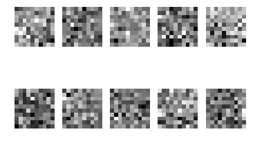
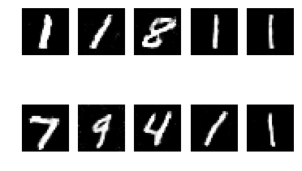

# Generative-Adversarial-Network

GAN's architecture is essentially made up of two neural networks that pit agaisnt each other - the discriminator and the generator. The generator, generates images from a D-dimensional noise vector in an attempt to mimic the real-world data, while the discriminator, is a binary classifier that learns to discern bertween true ‘real’ images and the generated ‘fake’ images. The generator’s objective is to fool the discriminator into classifying the generated data as ‘real’ while the discriminator is simultaneously learning how to distinguish the ‘real’ and ‘fake’ data. The objective of both the generator and discriminator is to degrade the performance of the alternate model. By training the two models against each other in this fashion, the generator will learn, from the discriminator, which features are the most prevalent in the ‘real’ data and will eventually produce comparable images.

In this project I tried to generate numbers that were created from Gaussian noise but were so realistic by the end of the training that the discriminator was completely fooled, thus giving 100% accuracy.

The initial gaussian noise before training:

that turned into these numbers with the help of the generator.

A few places GAN's can also be used are in generating artwork, changing facial expressions, and creating game backgrounds. 
